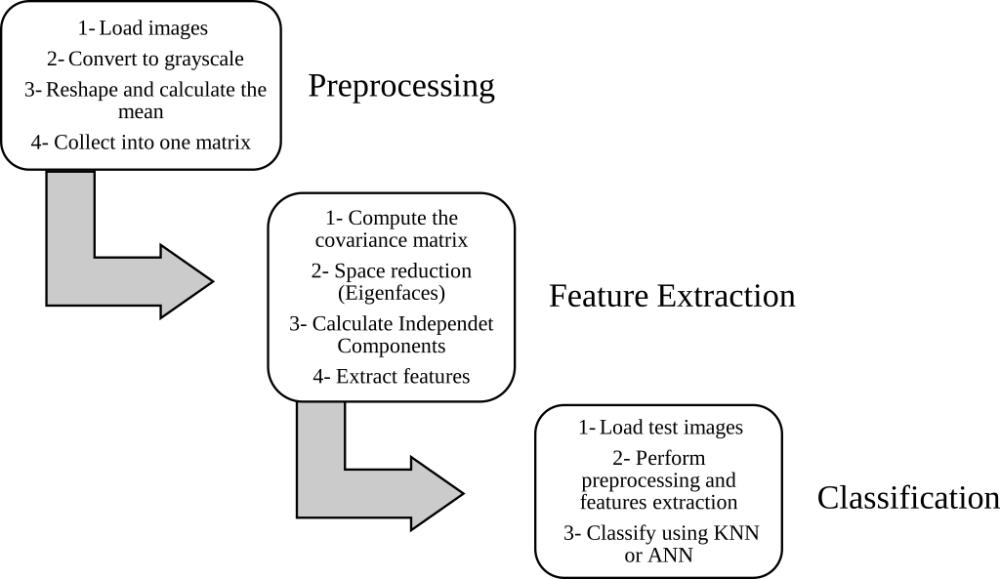
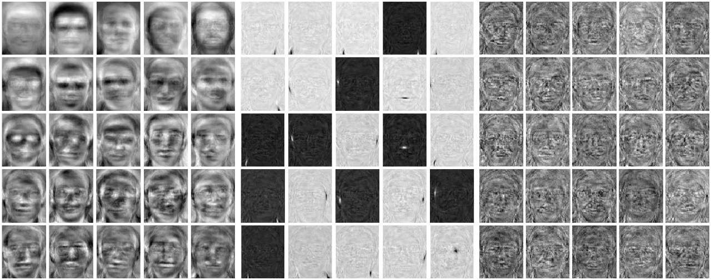

## Face Recognition using Independent Component Analysis (ICA)

### Introduction
Face recognition is one of the most familiar applications of image analysis and has gained
much attention in recent years. Several computational methods are implemented in this field,
appearance-based subspace analysis still gives the most promising results. This project is
a comparative study of the most popular appearance-based face recognition projection methods
(PCA and ICA). The three architectures discussed in **"Bartlett, M.S., Movellan, J.R., Sejnowski, T.J.: Face Recognition by Independent Component
Analysis, IEEE Trans. on Neural Networks, 13(6), (2002) 1450–1464"** are implemented in this project, and built-
in functions of artificial neural network, and K nearest-neighbors are used as the classification
method. Also two popular databases for face recognition (Yale and ORL) are used here in order to
test the accuracy of the implemented methods.

### Approach

### Results
The qualitative results of ORL database. (left) The first twenty-five eigenfaces, (middle) the first twenty-five
statistically independent basis images from first architecture, (right) the first twenty-five statistically independent
basis images from second architecture (ICA factorial representation).

### Authors: 
Sid Ali Rezetane, Sina M. Baharlou, Harold Agudelo 
Adviser: Prof. Aurelio Uncini

### How to run 

Download Yale and ORL face datasets; set the parameters in `nnTest.m` and `KnnTest.m` and run them with matlab.

